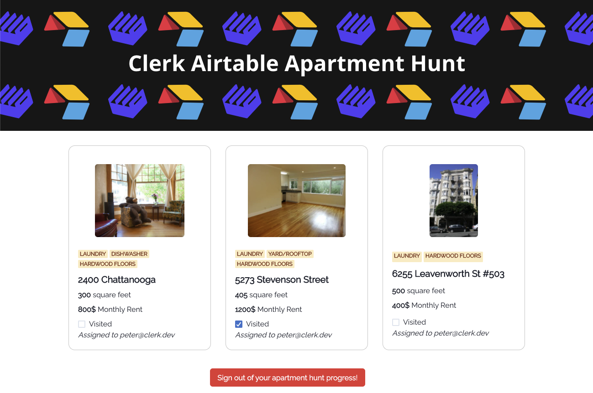

# Clerk - Airtable example repo

This repo shows an example use case for how you setup Airtable with [Clerk](https://clerk.dev) to achieve authenticated user access for your data.

---

**Clerk is Hiring!**

Would you like to work on Open Source software and help maintain this repository? Apply today https://apply.workable.com/clerk-dev/.

---

## Apartment Hunt App

The **Apartment Hunt App** allows authenticated access and visit status modification to apartments that have been assigned to specific users (_by email_) in the Airtable apartments database.

## Under the hood

This example app uses:

- [Clerk](https://clerk.dev) as an authentication provider.
- [Airtable](https://airtable.com/) for data storage.

## Where the magic happens

Authenticating Airtable data access using Clerk works by introducing a thin and customizable access management layer on top of the Airtable API.

- Authenticated resource [access requests](pages/api/apartments/index.ts#27).
- Manage authenticated resource [modification requests](pages/api/apartments/[id].ts#20).

### User authentication logic transparent from the client

Another point which seems a major benefit to most is that depending on the nature of the application, the access management logic and the user-attribute enhancement of the Airtable models, can happen fully on the server side transparently from the client code.

## Running the example

To run the example locally you need to:

1. Sign up for a Clerk account at http://clerk.dev/.
2. Setup your Airtable account and replicate the database as you can see at the [Airtable instructions](./docs/airtable_setup.md).
3. Clone this repository `git clone git@github.com:clerkinc/clerk-airtable-apartment-hunt.git`.
4. Setup the required Clerk Frontend API variable from your Clerk project as shown at [the example env file](./.env.example).
5. Setup the required Airtable environment variables as shown at [the example env file](./.env.example).
6. `yarn` to install the required dependencies.
7. `yarn dev` and you are good to go.

## Deploy on Heroku

## Contact

If you have any specific use case or anything you would like to ask, please reach out!
