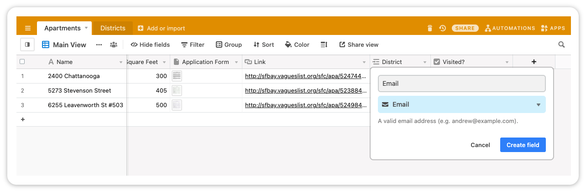

# Airtable setup for the example

To setup Airtable for the example app, you need to follow a few steps:

1. Create your Airtable [account](https://airtable.com).
2. Create a database using the [Apartment Hunting Template](https://airtable.com/templates/everyday-life/expPfTzGnfpwjgWlS/apartment-hunting)
3. Add a new `Email` column and fill it with the email addresses you want to try out the app.
   
